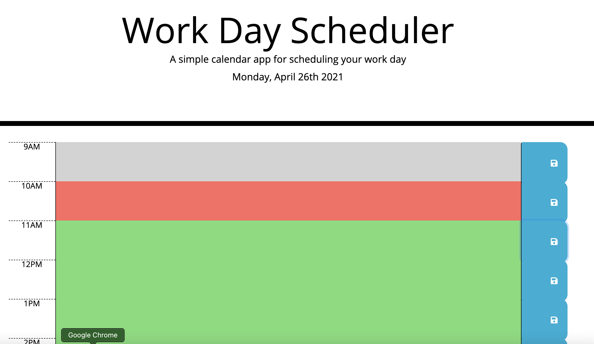
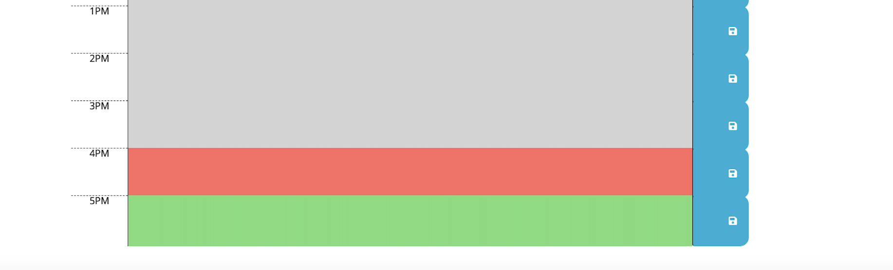

# Work-Day-Scheduler-Application

## Project Description

This project is a Work Day Scheduler Application built so that the user can schedule thier work day.  Once a task has been input and saved, the input will be saved and returned even when the page is reloaded.  The time slots have been color coordinated depending on whether the task is a past (gray), current (red), or future (green) action item.  

## Table of Contents 

- [About the Project](#about-the-project)
- [Installation](#installation)
- [Usage](#usage)
- [Credit](#credit)
- [License](#license)

## About the Project

- This project was built to allow the user the ability to schedule their work day and allow visibility on past, current and future action items.
- The motiviation for this project was to utilize JQuery and moment.js skills to create an application for users to schedule their work day.
- The current day and date will show at the top of the page once the page is loaded.
- Once the user inputs their task and saves it, the task will still be visible upon reload.
- The time blocks are color coordinated depending on the current time of day.  
- If the time for the task has passed, the time block will be gray.
- If the time for the task is current, the time block will be red.
- If the time for the task is for the future, the time block will be green.
- Comments have been added to the HTML, CSS and JS files to clarify each step and make future updates easier.

## Installation

- Open [Work Day Scheduler Application](https://twashke.github.io/Work-Day-Scheduler-Application/) 
- Or, open index.html in the internet browser.

## Usage

- Go to [Deployed Github Page](https://twashke.github.io/Work-Day-Scheduler-Application/)
- The current day and date will show at the top of the page.
- To enter a task, click on the time block the task is scheduled for and enter the action item, then click save.
- If the page is reloaded, the entered tasks will remain visible in the time block it was scheduled in.
- Depending on the current hour, the timeblocks will show different colors (past = gray, current = red, furture = green).

Work Day Scheduler Save Input and Refresh \
 

Work Day Scheduler Day and Date \
 

Color Change Depending on Time \
 

## Credit

- HTML and CSS files provided.
- Joshua Washke for his time helping me understand and troubleshoot issues.

## License

- No license for this project.